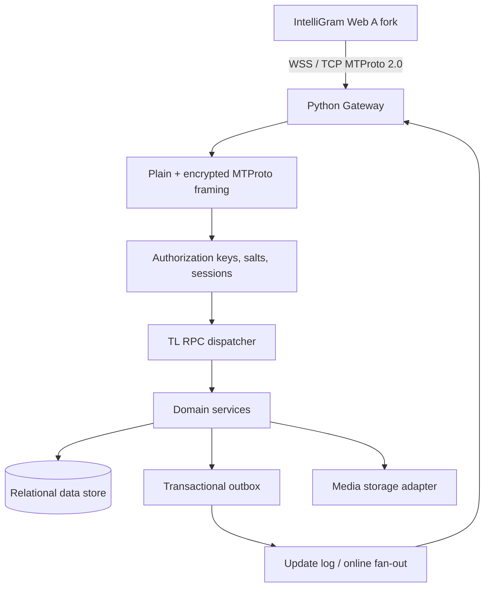

# IntelliGram Compatibility Contract

## Purpose and provenance

IntelliGram is a self-hosted messaging system that will retain the interaction model and visual behavior of the GPL-3.0 Telegram Web A source while replacing all Telegram production-network dependencies with a self-owned Python server. The server design is a Python port of the public Teamgram architecture and public MTProto/TL specifications, not a claim of access to Telegram’s unpublished backend. Telegram explicitly publishes Web A as GPL-3.0 client source, while the published MTProto documentation describes the transport and authorization protocol rather than a complete Telegram backend implementation. [1] [2] [3]

> **Compatibility means deterministic protocol and behavioral equivalence at the declared feature layer.** It does not mean connecting to Telegram’s production network, accepting Telegram credentials, impersonating Telegram, or promising undocumented backend behavior.

| Source | Intended use in IntelliGram | License / constraint |
|---|---|---|
| Telegram Web A (`Ajaxy/telegram-tt`) | Client UI/UX, client-side TL/RPC behavior, caching, lazy loading, and update-recovery semantics | GPL-3.0; preserve notices and distribute corresponding source. [1] |
| Teamgram Server | Server behavior, handler decomposition, event/update semantics, storage boundaries, and MTProto server reference | Apache-2.0; preserve notices. [4] |
| Telegram MTProto/TL documentation | Wire protocol, key negotiation, encryption framing, service messages, and serialized schema | Public protocol documentation; implement accurately and test against vectors. [2] [3] |

## Product boundary

The target is a **branded IntelliGram system**. Its server owns identities, data centers, server keys, authentication factors, storage, and network domains. The client will be an IntelliGram fork of Telegram Web A, configured exclusively for IntelliGram’s data-center descriptors and server public-key fingerprints. Telegram names, logo assets, official domains, API identity, and production endpoints will be removed or replaced.

The public Telegram Web A code starts a GramJS `TelegramClient`, uses a callback-backed session, opens secure WebSocket transport by default, and performs RPC through MTProto. It expects asynchronous updates plus `updates.getDifference` recovery rather than a REST-style request/response feed. The Python implementation must therefore expose MTProto/TL behavior for the direct-port client path; a separate developer REST API may exist, but it is not a substitute for the client compatibility protocol.

## Ported component model

| Teamgram component | Python IntelliGram port | Initial topology | Production evolution |
|---|---|---|---|
| `gnetway` | `intelligram.transport` | One `asyncio` TCP / WebSocket gateway process | Horizontally scaled stateless gateways |
| `session` + `authsession` | `intelligram.sessions` and `intelligram.auth` | In-process session/auth-key state backed by database | Isolated service with Redis session cache |
| BFF RPC handlers | `intelligram.tl.dispatch` | Typed handler registry in one process | Versioned handler packages |
| `biz` user/chat/dialog/message | `intelligram.domain` | Transactional application services | Independent services only after measured need |
| `msg` + `sync` | `intelligram.updates` | Durable transactional outbox and per-user update log | Broker-backed fan-out |
| `dfs` + `media` | `intelligram.media` | Local filesystem adapter for development | S3/MinIO adapter, media workers, malware scanning |
| `idgen` | `intelligram.ids` | Database-generated IDs + peer-ID mapper | Dedicated collision-free ID service if scale requires it |
| `status` | `intelligram.presence` | Durable presence/session heartbeats | Redis-backed ephemeral presence |

The early deployment intentionally avoids Teamgram’s mandatory Kafka, etcd, MinIO, and many service processes. It preserves their **interfaces and durable semantics**, particularly the transactional outbox and per-peer update cursors. This permits a working self-hosted single-node system first, then a safe split without rewriting the client protocol.

## Protocol layers

The gateway must implement the four transport forms represented by Teamgram’s public interface: abridged, intermediate, padded intermediate, and full. Web-client support prioritizes WebSocket plus an MTProto framing mode supported by the forked GramJS transport. [4]

MTProto 2.0 implementation is limited to the publicly documented client-server protocol: unencrypted authorization-key negotiation, RSA authentication of the server key, Diffie-Hellman key generation, server-salt/session validation, message identifiers and sequence numbers, AES-256-IGE encrypted envelopes, containers, acknowledgements, retries, and service errors. [2] This will use vetted cryptographic primitives only; no invented encryption schemes or weakened development keys are allowed.

## Client-visible compatibility slices

The whole product will be expanded by objectively testable slices. A slice is complete only when the client invokes the original TL method, receives the expected schema type, persists/reconciles state, and survives reconnect/difference recovery.

| Slice | Client-server obligations | Status target |
|---|---|---|
| Bootstrap | Self-hosted build configuration, data center records, application identity, RSA fingerprint/key publication, `help.getConfig`, secure transport connection | First runnable milestone |
| Account and authorization | MTProto key creation; QR/phone or controlled development authentication; session persistence; `users.getFullUser`; logout and authorization management | First usable account |
| Dialogs and lazy history | `messages.getDialogs`, `messages.getHistory`, `messages.getMessages`, pagination offsets, unread state, drafts, pins, peer dialogs | First usable messaging UI |
| Messaging and real-time updates | Text/send/edit/delete/forward/reply/reaction, idempotent random IDs, per-user `pts`, update envelopes, `updates.getState`, `updates.getDifference`, reconnection | Multi-device core |
| Contacts, users, and presence | Contact search/import, usernames, blocking, profile updates, typing and online status | Core social layer |
| Groups and channels | Basic groups, memberships, roles, invite links, channel creation/profile/actions, participant pagination, channel `pts` and `getChannelDifference` | Community features |
| Media | Upload parts, media reference lifecycle, storage authorization, range downloads, thumbnails and file-reference repair | File and media messaging |
| Full Web A extensions | Folders, saved messages, polls, topics, stories, bots/mini apps, calls, payments, premium, gifts, ads, AI compose, statistics | Individually implemented and verified |

The complete static client scan currently identifies **438 distinct schema-defined RPCs** referenced by Web A. Teamgram exposes direct filename-level matches for 146 of them; those results are stored in `ACTUAL_CLIENT_RPC_COVERAGE.md`. This is a coverage ledger, not an assertion that features are already complete.

## Required update and lazy-loading semantics

The source client uses viewport-dependent lazy loading: 40/60 first history messages, 25/30 visual chat rows, a 100-dialog fetch batch, 42 entries for media/search slices, and participant loads beginning at 30 with subsequent 200-member fetches. These values are client policy rather than server ceilings, so Python handlers must implement correct `offset_id`, `offset_date`, `add_offset`, `limit`, `max_id`, `min_id`, hash/not-modified, and cursor behavior. Responses must carry users/chats referenced by the result and preserve list order.

Every state mutation must be atomically coupled to update creation. The synchronization engine must maintain global `pts`, `qts`, `seq`, `date`, and per-channel `pts` where applicable. Online sessions receive the appropriate updates; offline/reconnected sessions recover through difference calls, without duplicate or skipped application of durable mutations. The server must accept an idempotency key for client-originated send operations and map it to MTProto random-ID semantics.

## Security contract

| Area | Required behavior |
|---|---|
| Cryptography | MTProto 2.0 only; generated, unique server RSA keys; DH validation; AES-IGE through vetted primitives; random salts/nonces; replay-window and message-ID checks. [2] |
| Credentials | Password hashing with Argon2id or equivalent memory-hard configuration; never store raw passwords or reusable development verification codes. |
| Sessions | Server-side auth-key lifecycle, revocation, device/session list, per-session scopes, expiration, and audit events. |
| Authorization | Validate peer membership and roles at each RPC; no client-supplied peer or message ID is trusted as permission evidence. |
| Data integrity | Database transactions for state + outbox; durable de-duplication of random IDs; append-only security events; migration controls. |
| Media | MIME and size validation, generated object keys, signed/range-limited downloads, optional malware scanning queue, and authorization on every fetch. |
| Rate limiting | Per-IP, account, auth-key, and peer-level quotas for login, key exchange, sends, search, upload, and invite actions. |
| Observability | Structured logs that exclude message text, passwords, keys, codes, and media bytes; metrics and trace IDs only. |

Telegram Web A does **not** expose a functional secret-chat UI flow in its application source. Its limited encrypted-chat references concern device authorization flags. The initial compatibility target therefore covers MTProto client-server encrypted cloud transport, while end-to-end Secret Chats remain a separately designed, separately audited extension rather than a fake or incomplete claim.

## Definition of complete

A feature is only marked complete when all of the following hold: the IntelliGram client fork invokes its original-style TL method; the Python server returns the expected constructor; a fresh client and a resumed client render the same state; cross-session updates converge after online and offline delivery; authorization failures yield the correct RPC error without data leakage; and an automated integration test proves the behavior against a disposable server database.

## References

[1]: https://github.com/Ajaxy/telegram-tt "Telegram Web A source repository"
[2]: https://core.telegram.org/mtproto/description "MTProto 2.0 detailed description"
[3]: https://core.telegram.org/mtproto/auth_key "MTProto authorization-key creation"
[4]: https://github.com/teamgram/teamgram-server "Teamgram Server source repository"
